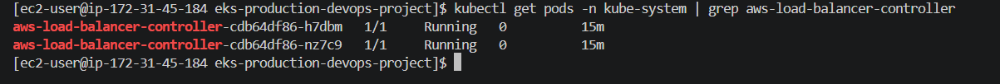
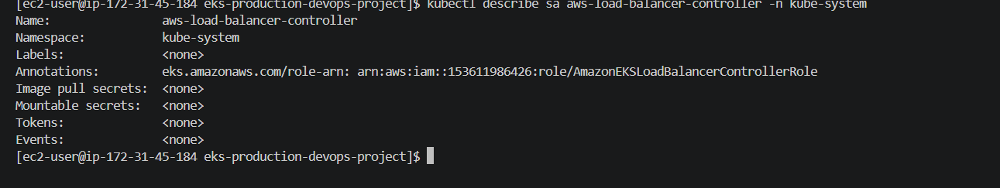
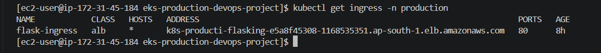
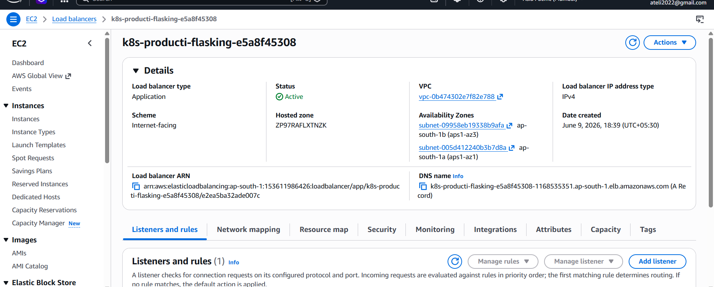
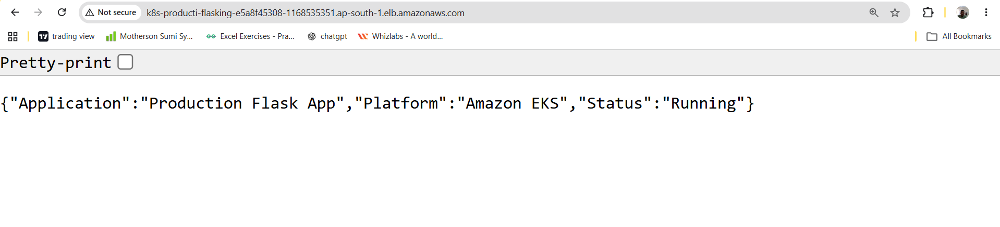

# AWS Load Balancer Controller

## Overview

AWS Load Balancer Controller integrates Kubernetes Ingress resources with AWS Application Load Balancers.

---

## Components

- IAM Policy
- IAM Service Account (IRSA)
- OIDC Provider
- AWS Load Balancer Controller
- Ingress Resource
- Application Load Balancer

---

## Architecture

User
↓

AWS ALB
↓

Ingress
↓

Service
↓

Pods

---

## Installation

helm install aws-load-balancer-controller ...

---

## Validation

kubectl get pods -n kube-system

kubectl get ingress -n production

---

## Troubleshooting Encountered

### ServiceAccount Missing

Fixed using:

eksctl create iamserviceaccount

### CrashLoopBackOff

Error:

failed to get VPC ID

Fix:

helm upgrade aws-load-balancer-controller \
--set vpcId=<VPC-ID>

### ALB Address Not Generated

Verify:

kubectl get ingress -o wide

---

## Final Validation

curl http://<ALB-DNS-NAME>

Response:

{
  "Application":"Production Flask App",
  "Platform":"Amazon EKS",
  "Status":"Running"
}

---

## Learning Outcomes

- AWS Load Balancer Controller
- IRSA
- OIDC
- ALB Ingress
- Kubernetes Networking

---

## Screenshots

## Load Balancer Controller

## IRSA Role

## Ingress Created

## ALB Active

## Application Accessible

