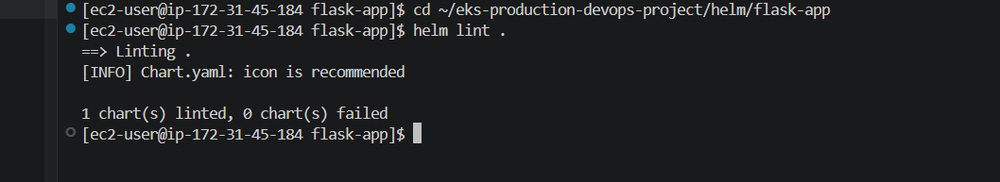
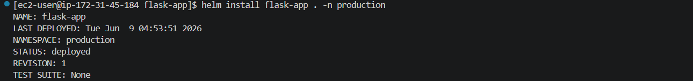
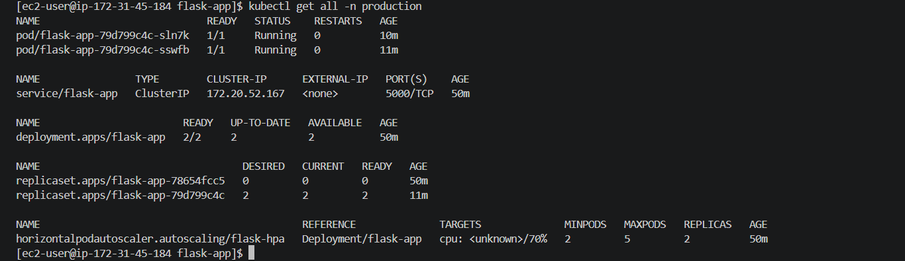
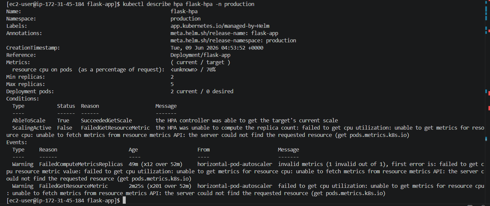
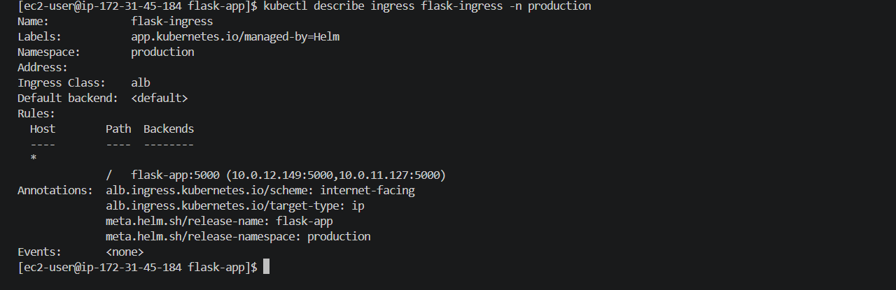

# Helm Deployment

## Overview

This module deploys the Flask application using Helm.

The chart follows production deployment practices and includes:

* Deployment
* Service
* Ingress
* HPA
* ConfigMap
* Secret
* ServiceMonitor

---

## Helm Architecture

Helm Chart

↓

Deployment

↓

Service

↓

Ingress

↓

AWS Application Load Balancer

↓

End Users

---

## Components

| Resource       | Purpose                |
| -------------- | ---------------------- |
| Deployment     | Application workload   |
| Service        | Internal communication |
| Ingress        | External access        |
| HPA            | Autoscaling            |
| ConfigMap      | Configuration          |
| Secret         | Sensitive data         |
| ServiceMonitor | Prometheus integration |

---

## Installation

```bash
helm install flask-app helm/flask-app -n production
```

## Upgrade

```bash
helm upgrade flask-app helm/flask-app -n production
```

## Rollback

```bash
helm rollback flask-app 1 -n production
```

---

## Validation

```bash
helm list -n production
```

```bash
kubectl get all -n production
```

```bash
kubectl get ingress -n production
```

```bash
kubectl get hpa -n production
```

---

## Production Features

* Readiness Probes
* Liveness Probes
* Resource Limits
* Autoscaling
* Monitoring Integration
* ALB Ingress
* Helm Rollbacks

---

## Troubleshooting

### ServiceMonitor Not Found

Install kube-prometheus-stack first.

### HPA Not Working

Install Metrics Server.

### ALB Not Creating

Verify AWS Load Balancer Controller.

### Pods CrashLoopBackOff

Check:

```bash
kubectl logs <pod-name>
```

---

## Interview Questions

### What is Helm?

Package manager for Kubernetes.

### Helm Install vs Upgrade?

Install = New release

Upgrade = Existing release update

### Why Helm?

Reusable templates and version control.

### What is values.yaml?

Configuration file for Helm templates.

---

## Learning Outcomes

* Helm Templating
* Kubernetes Packaging
* Ingress Management
* Autoscaling
* Production Deployments
* Rollback Strategies

---

## Screenshots

## Helm Lint



## Helm Install



## Application Resources



## HPA



## Ingress



