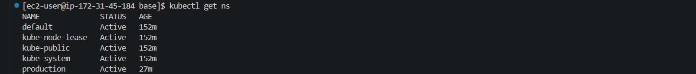
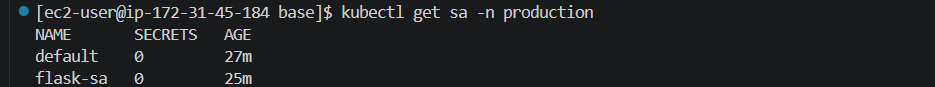
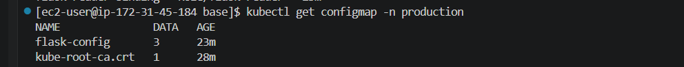
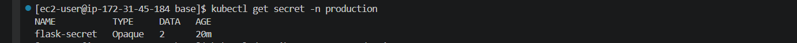
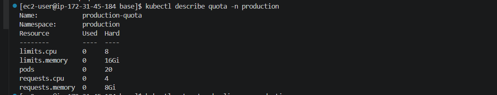
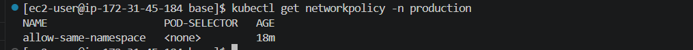

# Kubernetes Foundation

## Overview

This module establishes the production Kubernetes foundation required before deploying applications.

The goal is to implement security, governance, namespace isolation, RBAC, quotas, and networking controls.

---

## Components

* Namespace
* Service Account
* RBAC
* ConfigMap
* Secret
* ResourceQuota
* LimitRange
* NetworkPolicy

---

## Architecture

production Namespace

├── ServiceAccount

├── Role

├── RoleBinding

├── ConfigMap

├── Secret

├── ResourceQuota

├── LimitRange

└── NetworkPolicy

---

## Deployment

```bash
kubectl apply -f kubernetes/base/
```

---

## Validation

### Verify Namespace

```bash
kubectl get ns
```

### Verify Resources

```bash
kubectl get all -n production
```

### Verify RBAC

```bash
kubectl get role,rolebinding -n production
```

### Verify Quotas

```bash
kubectl describe quota -n production
```

### Verify Network Policies

```bash
kubectl get networkpolicy -n production
```

---

## Security Features

### Namespace Isolation

Separates workloads from other environments.

### RBAC

Implements least privilege access.

### Secrets

Stores sensitive application credentials.

### Network Policies

Controls pod-to-pod communication.

### Resource Governance

ResourceQuota and LimitRange prevent resource abuse.

---

## Troubleshooting

### Pod Cannot Access Kubernetes API

Check:

```bash
kubectl get sa -n production
```

### Resource Quota Exceeded

Check:

```bash
kubectl describe quota -n production
```

### Network Connectivity Issues

Check:

```bash
kubectl describe networkpolicy -n production
```

---

## Interview Questions

### What is RBAC?

Role-Based Access Control.

### ConfigMap vs Secret?

ConfigMap → Non-sensitive data

Secret → Sensitive data

### Why use Namespaces?

Isolation and resource management.

### What is a Service Account?

Identity used by Pods to access Kubernetes APIs.

---

## Learning Outcomes

* Kubernetes Security
* Namespace Isolation
* RBAC
* Secrets Management
* Resource Governance
* Network Policies

---

## Screenshots

## Namespace



## Service Account



## RBAC


## ConfigMap



## Secret



## Resource Quota



## Network Policy



