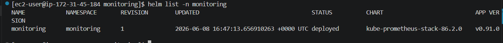
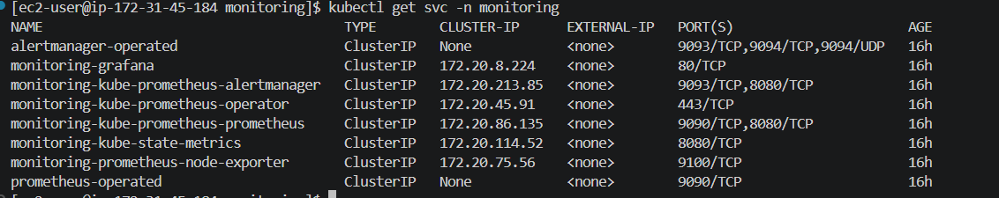
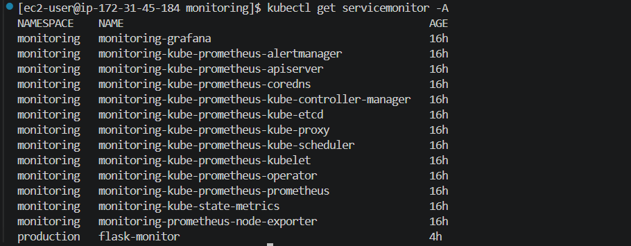
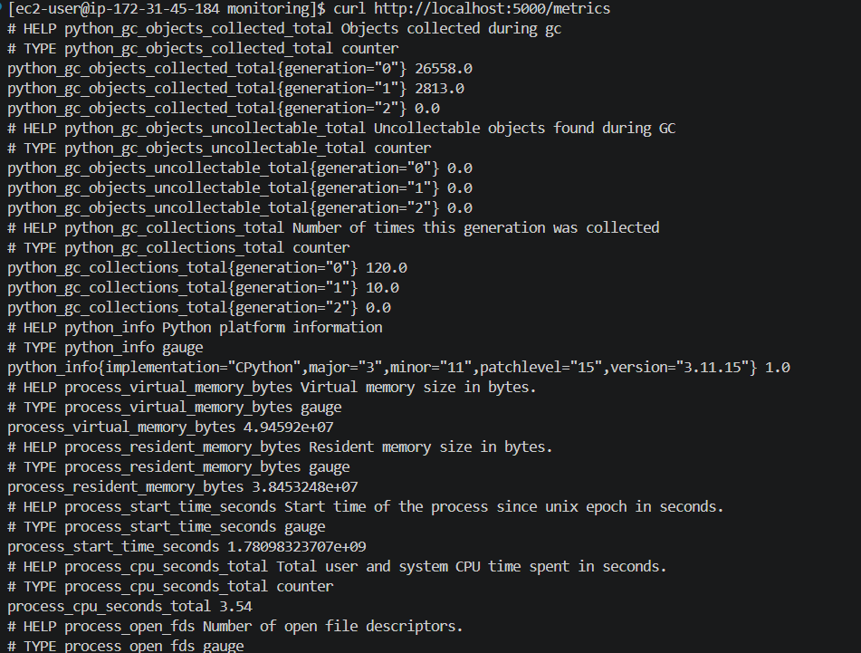
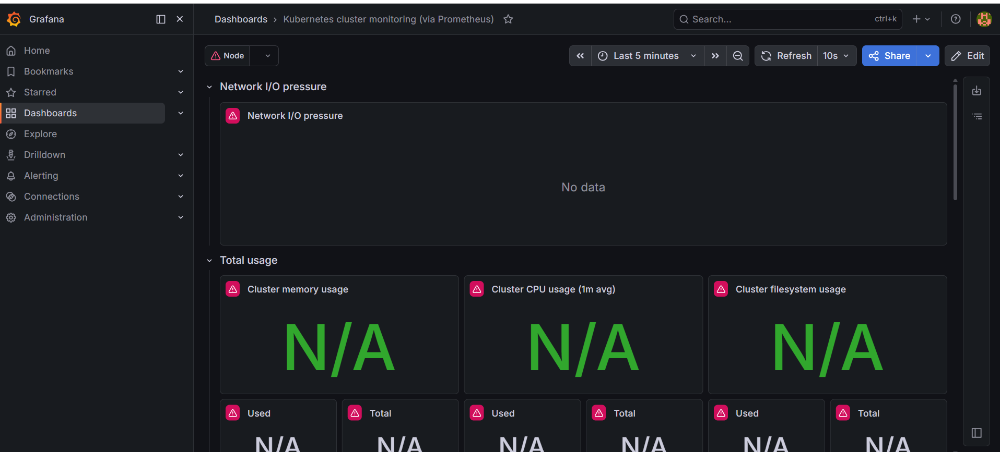
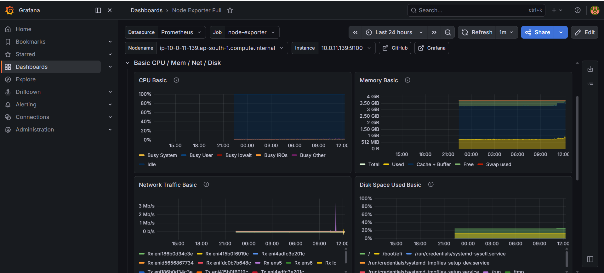
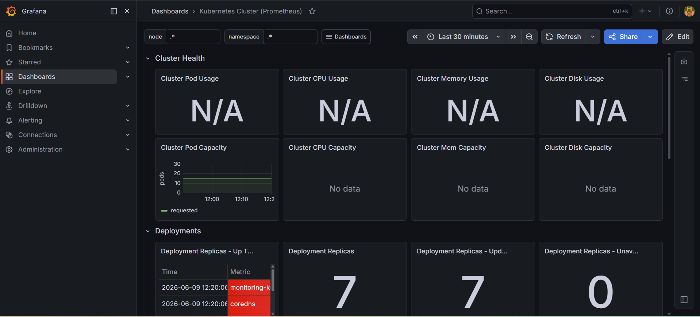

# Monitoring Stack

## Overview

This module implements a production-grade Kubernetes monitoring and observability platform using Prometheus, Grafana, AlertManager, kube-state-metrics, node-exporter, and ServiceMonitor resources.

The monitoring stack provides:

* Cluster Monitoring
* Node Monitoring
* Pod Monitoring
* Application Monitoring
* Alerting
* Dashboard Visualization
* Resource Usage Analysis
* Horizontal Pod Autoscaler Metrics

---

# Monitoring Architecture

Application Pods

↓

ServiceMonitor

↓

Prometheus

↓

AlertManager

↓

Notifications


Prometheus

↓

Grafana Dashboards

Node Exporter

↓

Prometheus

kube-state-metrics

↓

Prometheus

---

# Components

| Component          | Purpose                      |
| ------------------ | ---------------------------- |
| Prometheus         | Metrics Collection & Storage |
| Grafana            | Dashboard Visualization      |
| AlertManager       | Alert Processing             |
| kube-state-metrics | Kubernetes Object Metrics    |
| node-exporter      | Node-Level Metrics           |
| ServiceMonitor     | Service Discovery            |
| PrometheusRule     | Alert Rules                  |
| Metrics Server     | HPA Metrics                  |

---

# Monitoring Data Flow

1. Flask Application exposes metrics
2. ServiceMonitor discovers application service
3. Prometheus scrapes metrics
4. Metrics stored in Prometheus TSDB
5. Grafana queries Prometheus
6. Dashboards display metrics
7. AlertManager processes alerts
8. Notifications sent to operators

---

# Deployment

## Add Helm Repository

```bash
helm repo add prometheus-community https://prometheus-community.github.io/helm-charts

helm repo update
```

---

## Install Monitoring Stack

```bash
helm install monitoring \
prometheus-community/kube-prometheus-stack \
-n monitoring \
--create-namespace
```

---

## Verify Installation

```bash
kubectl get pods -n monitoring
```

Expected:

```text
Prometheus Running
Grafana Running
AlertManager Running
kube-state-metrics Running
node-exporter Running
```

---

# Monitoring Validation

## Verify Monitoring Pods

```bash
kubectl get pods -n monitoring
```

---

## Verify ServiceMonitor

```bash
kubectl get servicemonitor -A
```

Expected:

```text
flask-monitor
```

---

## Verify Prometheus Rules

```bash
kubectl get prometheusrule -n monitoring
```

---

## Verify Metrics Collection

```bash
kubectl top nodes
```

Example:

```text
CPU(cores) MEMORY(bytes)
52m        879Mi
54m        870Mi
```

---

## Verify Pod Metrics

```bash
kubectl top pods -n production
```

Example:

```text
flask-blue-xxxxx
flask-blue-yyyyy
```

---

# Grafana Access

## Get Admin Password

```bash
kubectl get secret monitoring-grafana \
-n monitoring \
-o jsonpath="{.data.admin-password}" | base64 -d
```

---

## Port Forward

```bash
kubectl port-forward svc/monitoring-grafana \
-n monitoring \
3000:80
```

Open:

```text
http://localhost:3000
```

Default Username:

```text
admin
```

---

# Prometheus Access

```bash
kubectl port-forward svc/monitoring-kube-prometheus-prometheus \
-n monitoring \
9090
```

Open:

```text
http://localhost:9090
```

---

# Dashboard Examples

## Kubernetes Cluster Dashboard

Displays:

* Node Health
* CPU Utilization
* Memory Utilization
* Pod Status
* Network Usage

---

## Node Exporter Dashboard

Displays:

* CPU Usage
* Memory Usage
* Disk Usage
* Network Throughput

---

## Application Dashboard

Displays:

* Request Count
* Response Time
* Error Rate
* Throughput
* Availability

---

# ServiceMonitor Discovery

ServiceMonitor allows Prometheus to automatically discover services inside Kubernetes.

Example:

```yaml
apiVersion: monitoring.coreos.com/v1
kind: ServiceMonitor
```

Benefits:

* Automatic Target Discovery
* Dynamic Scaling Support
* Kubernetes Native Monitoring

---

# AlertManager Workflow

Prometheus Alert
↓

PrometheusRule
↓

AlertManager
↓

Notification Channel

Examples:

* Email
* Slack
* Microsoft Teams
* PagerDuty

---

# Example Alert Rules

## High CPU Usage

```yaml
alert: HighCPUUsage
expr: node_cpu_seconds_total > 80
for: 5m
```

---

## High Memory Usage

```yaml
alert: HighMemoryUsage
expr: node_memory_MemAvailable_bytes < 20
for: 5m
```

---

## Pod Restart Alert

```yaml
alert: PodRestarting
expr: kube_pod_container_status_restarts_total > 5
```

---

# Useful PromQL Queries

## CPU Usage

```promql
100 - (avg by(instance)(rate(node_cpu_seconds_total{mode="idle"}[5m])) * 100)
```

---

## Memory Usage

```promql
(node_memory_MemTotal_bytes - node_memory_MemAvailable_bytes)
/
node_memory_MemTotal_bytes
* 100
```

---

## Pod Count

```promql
count(kube_pod_info)
```

---

## Running Pods

```promql
count(kube_pod_status_phase{phase="Running"})
```

---

## Node Count

```promql
count(kube_node_info)
```

---

# Production Monitoring Features

Implemented:

* Cluster Monitoring
* Node Monitoring
* Pod Monitoring
* Application Monitoring
* Metrics Collection
* Dashboard Visualization
* Service Discovery
* Resource Monitoring
* HPA Metrics Integration

---

# Troubleshooting

## ServiceMonitor CRD Missing

Error:

```text
no matches for kind ServiceMonitor
```

Resolution:

```bash
helm install monitoring \
prometheus-community/kube-prometheus-stack
```

---

## Metrics API Not Available

Error:

```text
kubectl top nodes

Metrics API not available
```

Resolution:

Install Metrics Server.

```bash
kubectl apply -f https://github.com/kubernetes-sigs/metrics-server/releases/latest/download/components.yaml
```

---

## HPA Unable To Fetch Metrics

Error:

```text
unable to fetch metrics from resource metrics API
```

Resolution:

Verify Metrics Server.

```bash
kubectl get apiservices | grep metrics
```

---

## Prometheus Targets Down

Check:

```bash
kubectl get servicemonitor -A

kubectl get endpoints -A
```

---

# Interview Questions

## What is Prometheus?

Prometheus is an open-source monitoring and alerting toolkit designed for cloud-native environments.

---

## What is Grafana?

Grafana is a visualization platform used to create dashboards from Prometheus metrics.

---

## What is ServiceMonitor?

A Kubernetes custom resource used by Prometheus Operator to discover services automatically.

---

## What is AlertManager?

AlertManager manages alerts generated by Prometheus and routes them to notification channels.

---

## Difference Between Metrics and Logs?

Metrics:

* Numerical values
* Time-series data
* Used for monitoring

Logs:

* Detailed events
* Text records
* Used for troubleshooting

---

## Why Node Exporter?

Node Exporter collects operating system and hardware metrics from Kubernetes worker nodes.

---

## Why kube-state-metrics?

Provides Kubernetes object metrics such as:

* Deployments
* Pods
* Services
* StatefulSets
* Nodes

---

# Learning Outcomes

* Kubernetes Observability
* Prometheus Operator
* Grafana Dashboards
* Alerting Strategies
* Service Discovery
* PromQL
* Metrics Server
* HPA Monitoring
* Production Monitoring Architecture

---

# Screenshots

## Prometheus Installation



## AlertManager



## ServiceMonitor



## Flask Metrics



## Kubernetes Dashboard



## Node Exporter Dashboard



## Pod Dashboard



