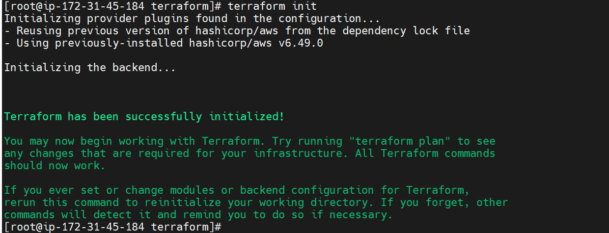

# Terraform Infrastructure

## Overview

This module provisions the complete AWS infrastructure required to run a production-grade Amazon EKS platform using Infrastructure as Code (IaC).

The infrastructure is fully automated using Terraform and follows AWS best practices for scalability, security, and maintainability.

---

## Architecture

Terraform provisions:

* VPC
* Public Subnets
* Private Subnets
* Internet Gateway
* NAT Gateway
* Route Tables
* Security Groups
* IAM Roles
* OIDC Provider
* Amazon EKS Cluster
* Managed Node Group

Architecture Flow:

Internet

↓

Internet Gateway

↓

Public Subnets

↓

NAT Gateway

↓

Private Subnets

↓

EKS Worker Nodes

---

## Components

| Component       | Purpose                               |
| --------------- | ------------------------------------- |
| VPC             | Isolated network environment          |
| Public Subnets  | NAT Gateway and external resources    |
| Private Subnets | Secure EKS worker nodes               |
| NAT Gateway     | Outbound internet access              |
| Security Groups | Network security                      |
| IAM Roles       | AWS permissions                       |
| OIDC Provider   | IAM Roles for Service Accounts (IRSA) |
| EKS Cluster     | Kubernetes Control Plane              |
| Node Group      | Worker nodes                          |

---

## Deployment

### Initialize Terraform

```bash
terraform init
```

### Validate Configuration

```bash
terraform validate
terraform fmt
```

### Review Infrastructure

```bash
terraform plan
```

### Create Infrastructure

```bash
terraform apply
```

---

## Validation

### Verify Cluster

```bash
aws eks list-clusters
```

Expected:

```text
eks-production
```

### Verify Nodes

```bash
kubectl get nodes
```

Expected:

```text
Ready
Ready
```

### Verify OIDC Provider

```bash
aws eks describe-cluster \
--name eks-production \
--query "cluster.identity.oidc.issuer"
```

---

## Production Design Decisions

### Why Private Subnets?

Worker nodes are deployed in private subnets to prevent direct internet exposure.

### Why NAT Gateway?

Allows worker nodes to pull container images and updates without exposing them publicly.

### Why Remote State?

Terraform state is stored in Amazon S3 with DynamoDB locking for:

* Team collaboration
* State consistency
* Disaster recovery

### Why OIDC?

Required for:

* AWS Load Balancer Controller
* External DNS
* Cluster Autoscaler
* IRSA

---

## Troubleshooting

### Node Group Not Joining Cluster

Check:

```bash
aws eks describe-nodegroup \
--cluster-name eks-production \
--nodegroup-name production-workers
```

Common causes:

* Missing IAM policies
* Incorrect subnet configuration
* NAT Gateway issues

### Terraform State Issues

Verify:

```bash
terraform state list
```

Check backend:

```bash
aws s3 ls s3://neeraj-devops-terraform-state
```

---

## Interview Questions

### What is Terraform State?

Terraform state maps real AWS resources to Terraform configuration.

### Why use S3 Backend?

Centralized and secure state storage.

### Why DynamoDB Locking?

Prevents concurrent terraform apply operations.

### Difference between count and for_each?

count uses indexes.

for_each uses keys and values.

---

## Learning Outcomes

* Infrastructure as Code
* AWS Networking
* EKS Architecture
* Terraform Remote Backend
* IAM & OIDC Integration
* Managed Node Groups
* Production Networking

---

## Screenshots


